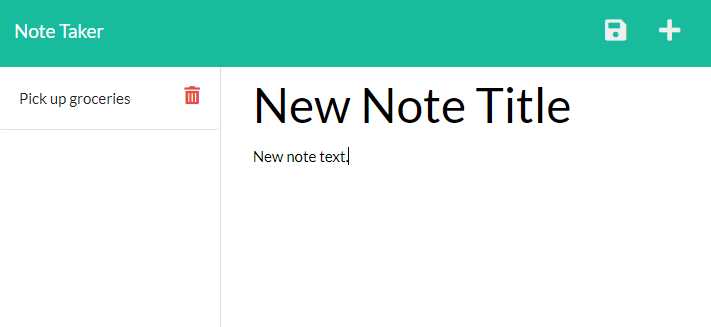

# Note-Taker

## Description
An application that can be used to write and save notes.

## Table of Contents
* [Usage](#usage)
* [Example](#example)
* [Contributing](#contributing)
* [License](#license)
* [Questions](#questions)

## Example
[https://note-taker-victor.herokuapp.com/](https://note-taker-victor.herokuapp.com/)

## Usage
Press the plus (+) symbol to create a new note. Press the file symbol to save the note to the list. Press the red trash-can to discard a note.

## Contributing
Contributions are welcome, see contact info below.

## License
The Note-Taker project is under the [MIT License](http://choosealicense.com/licenses/mit/). See the link for more details.

## Questions
GitHub: [sample-user](https://www.github.com/sample-user)

E-mail: [sample-user@gmail.com](mailto:sample-user@gmail.com)
